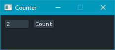
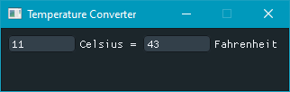
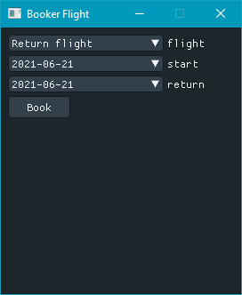
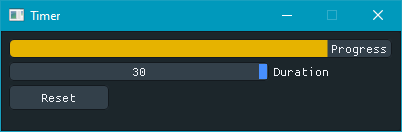
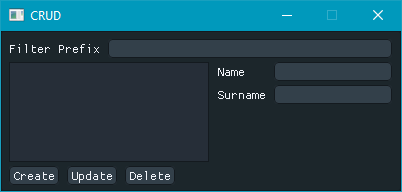

# Seven GUI Tasks for GIU library
This is an implementation of [the 7GUIs tasks](https://eugenkiss.github.io/7guis/) written with [Golang](https://golang.org/) and [GIU](https://github.com/AllenDang/giu) library.

* Counter
```
go run ./cmd/counter/main.go
```



* Temperature
```
go run ./cmd/temperature/main.go
```



* Flightbooker
```
go run ./cmd/flightbooker/main.go
```



* Timer
```
go run ./cmd/timer/main.go
```


* CRUD
```
go run ./cmd/crud/main.go
```

